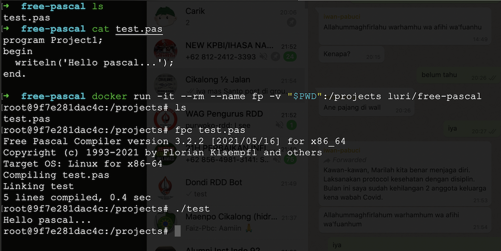

# Free Pascal Docker

Free Pascal Docker

Based on:

- Ubuntu 20.04
- [Free Pascal 3.2.2](https://www.freepascal.org/)
- Apache +modcgi

USAGE:


Linux/Mac
```
docker run -it --rm --name fp -v "$PWD":/projects luri/free-pascal
```

Windows
```
docker run -it --rm --name fp -v "%CD%":/projects luri/free-pascal
```




